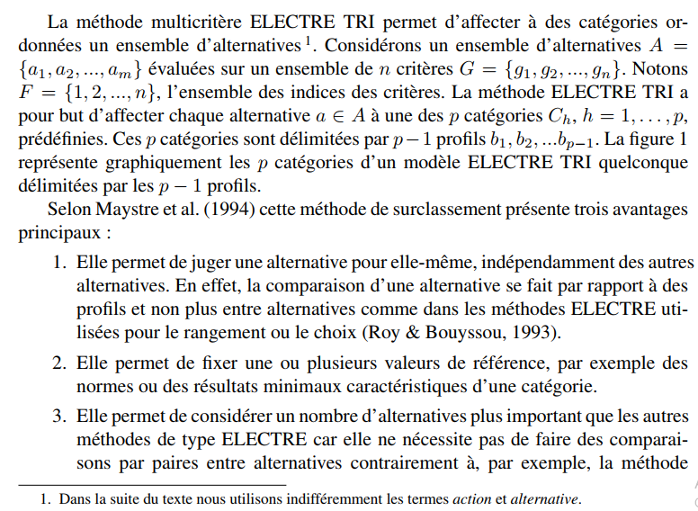

## Probleme : Le Nutri-Score vu comme un problème d’Aide Multicritères à la Décision  

Plus de détails avec :  
- **Nutri-score** et **Electre-tri** : https://www.lamsade.dauphine.fr/~mayag/Projet_2019_2020_Partie_2.pdf    
- Nutri-score, Methode de calcul du Nutri-soce et de classification des aliments (**système de feux tricolore**, **Classification NOVA**, **application YUKA**), [Projet_2020_2021.pdf ](Projet_2020_2021.pdf ) 
- Autres ressources : https://pdfs.semanticscholar.org/eb68/f8e6f51c333e554d79c412541e72f2838f58.pdf  

## Solution :
  - Notebook : [Electre_tri.ipynb](Electre_tri.ipynb)
  - Script : [main.py](main.py)

## Electre-tri ?

Intégration de la méthode d’aide à la déision ELECTRE TRI dans un système d’information géographique open source : Olivier Sobrie, Marc Pirlot, Florent Joerin